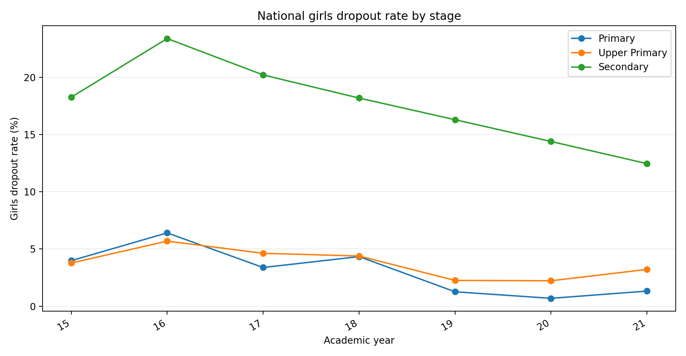
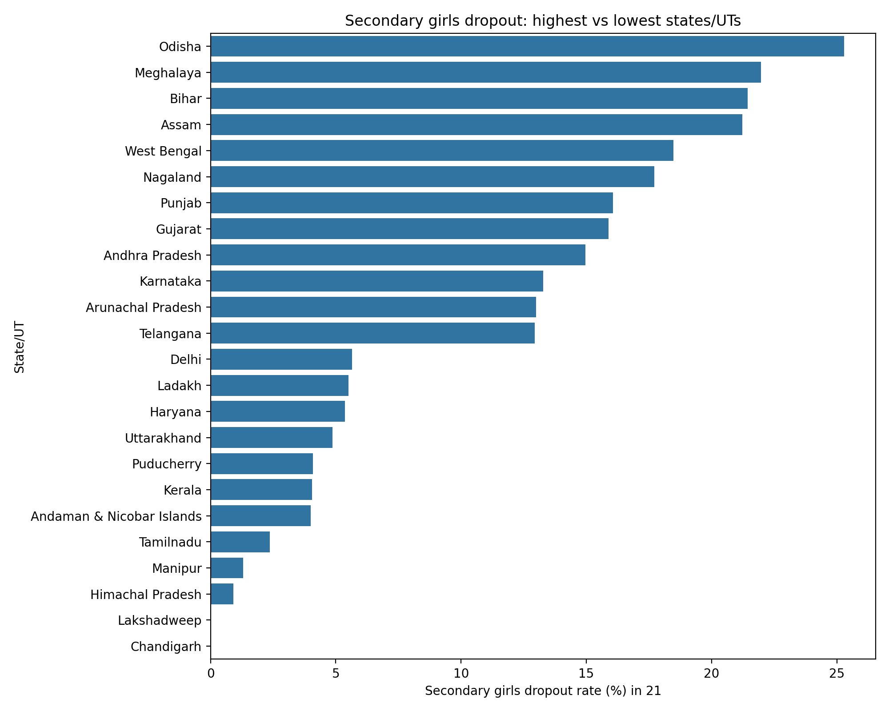
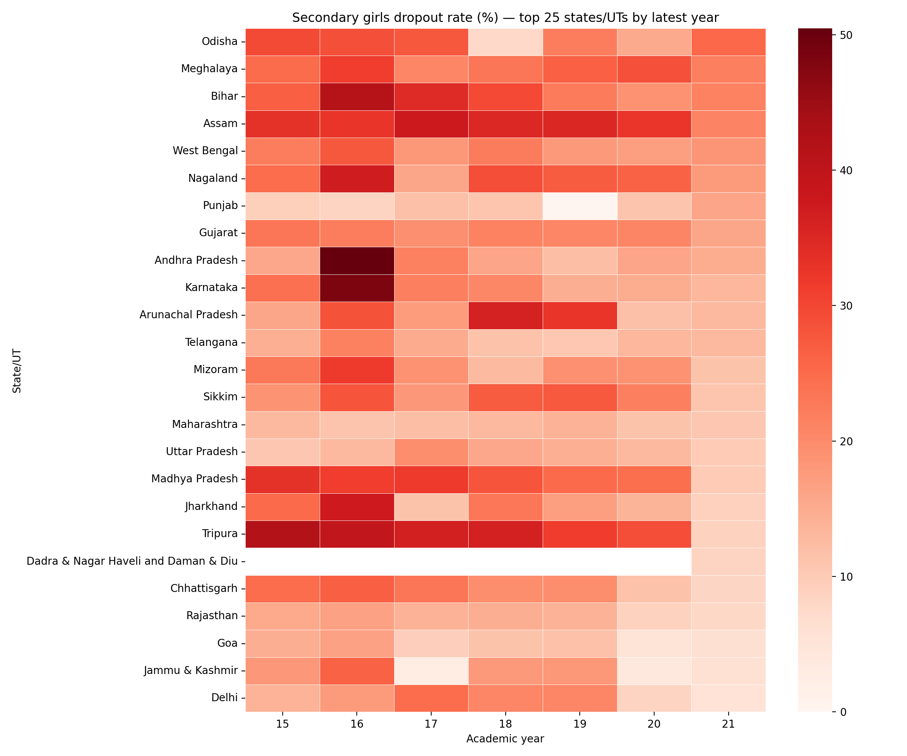

# GIRLS' EDUCATION IN INDIA: A Data-Driven Analysis of Secondary Dropout Trends

**Prepared for:** Additional Secretaries, IAS Officers, Ministry of Education  
**Data Source:** UDISE+ (Unified District Information System for Education)  
**Period:** Academic Years 2015-16 to 2021-22  
**Focus:** Girls' Secondary Education Dropout Rates (Class IX-X transition)

---

## EXECUTIVE SUMMARY

India is making **measurable progress** in girls' education, but significant **regional disparities** persist. Secondary girls' dropout rates have **declined 5.8 percentage points** from 18.26% to 12.46% in seven years—a **32% improvement**. However, five states still lose more than **one in five** girls at the secondary transition point.

**Key Finding:** *A 1.4 percentage point annual improvement trajectory, if maintained, could bring national girls' secondary dropout to single digits within 3 years.*

---

## SECTION 1: THE CURRENT STATE

### National Picture (Academic Year 2021-22)

| Education Level | Girls Dropout Rate |
|:---|---:|
| **Primary (Classes I-V)** | 1.32% |
| **Upper Primary (Classes VI-VIII)** | 3.21% |
| **Secondary (Classes IX-X)** | **12.46%** |

**Interpretation:** 
- Primary education is near-universal (98.7% retention)
- The critical dropout **cliff occurs at secondary transition**
- Of every 1,000 girls entering Class IX, approximately **125 do not advance to Class X**

### The Learning Trajectory

Girls who complete primary are very likely to persist through upper primary. **The secondary transition (Class IX→X) is where the system loses girls at scale.**

---

## SECTION 2: THE PROGRESS STORY (2015-16 to 2021-22)

### National Trend: A Clear Improvement Pattern

```
Secondary Girls Dropout Rate Over Time
18.26% ──────── (2015-16)
        │
        ├→ 23.39% (2016-17)  [Raised concerns]
        │      
        └→ 20.21% (2017-18)  [Correction phase]
            ↓
           18.19% (2018-19)
            ↓
           16.30% (2019-20)  [COVID year - stable]
            ↓
           14.39% (2020-21)  [Recovery begins]
            ↓
           12.46% (2021-22)  [Current state]
```

**Trend Analysis:** 
- **Linear improvement rate:** -1.40 percentage points per year
- **Total improvement:** 5.8 percentage points (32% reduction)
- **Status-quo projection (3-year forecast):**
  - 2022-23: 11.98%
  - 2023-24: 10.58%
  - 2024-25: 9.17%

**What This Means:** If current policies and initiatives maintain their effectiveness, India could achieve **single-digit secondary girls' dropout rates within three years**.

**Visual Trend:**



*The chart above shows the consistent -1.40 pp/year decline across all school tiers, with secondary (blue line) as the priority intervention zone.*

---

## SECTION 3: REGIONAL DISPARITIES - THE BOTTLENECK

### Crisis States: Where Intervention is Critical

**Five states lose more than 20% of girls at secondary transition:**

| State | Dropout Rate | Girls Lost per 1000 |
|:---|---:|---:|
| **Odisha** | 25.28% | 253 |
| **Meghalaya** | 21.97% | 220 |
| **Bihar** | 21.45% | 215 |
| **Assam** | 21.23% | 212 |
| **West Bengal** | 18.47% | 185 |

**Geographic Pattern:** Predominantly Eastern and North-Eastern states. These five states account for ~25% of India's secondary girls but losing ~30% of the national annual dropout.

### Success Stories: Where It Works

**States achieving near-zero dropout:**

| State/UT | Dropout Rate | Notes |
|:---|---:|:---|
| **Chandigarh** | 0.00% | Urban, high development |
| **Lakshadweep** | 0.00% | Small, managed closely |
| **Himachal Pradesh** | 0.91% | Mountain state success model |
| **Manipur** | 1.30% | Cultural priority on girls' education |
| **Tamilnadu** | 2.37% | Strong implementation track record |

**Success Factor:** These regions combine infrastructure investment + targeted retention schemes + cultural support for girls' education.

**Visual State Rankings:**



*Stark contrast: Odisha (25.3%) loses 1 in 4 girls, vs Chandigarh (0%) loses none. This 25-percentage-point gap represents policy and implementation variance.*

---

## SECTION 4: WHAT DRIVES IMPROVEMENT? (The Driver Analysis)

Before jumping to actions, we need to understand **why some states improved dramatically while others stagnated**. The data reveals three distinct patterns:

### Pattern 1: "Created States" Success Model
**Tripura, Chhattisgarh, Jharkhand, Manipur—the outliers**

| State | Improvement | Creation Year | Notes |
|:---|---:|:---|:---|
| **Tripura** | -33.25 pp | 1972 | Strong local governance + women's movement history |
**Heatmap: Improvement Patterns Across Top 25 States**



*The darkening red color as we move right (2015-16 to 2021-22) shows the national trend of improvement. Notice which state rows get lighter fastest (Tripura, MP, Chhattisgarh) vs. which stay dark (Odisha, Bihar, Assam).*

---

## SECTION 62: "High-Base to Success" Model
**Large, wealthy states improving from already-low starting points**

| State | Improvement | Starting Rate | Profile |
|:---|---:|---:|:---|
| **Madhya Pradesh** | -23.23 pp | 31.85% | Large state; targeted state-level intervention |
| **Tamilnadu** | -2.22 pp | 4.59% | Already performing; consolidating gains |
| **Himachal Pradesh** | Stable | 0.91% | Mountain state; strong infrastructure from start |

**Hypothesis:** Central focus + sufficient resources + institutional capacity = scalable improvement.

### Pattern 3: "Stuck" States (Intervention Resistance)
**States showing <2% improvement over 7 years despite national trend**

| State | Current Rate | Change | Notes |
|:---|---:|---:|:---|
| **Punjab** | 16.07% | Deteriorated | Paradox: wealthy state, poor girls' retention |
| **Uttar Pradesh** | 16.77% | Minimal | Large, complex; implementation fragmented |
| **Andhra Pradesh** | 14.96% | Minimal | Post-bifurcation administrative disruption |

**Hypothesis:** Large states with complex administration + competing priorities + uneven district capacity = inertia. **Critical insight:** Wealth alone doesn't drive improvement. Institutional focus + targeted implementation do.

### What the Drivers Tell Us

**Success Factors (ranked by evidence strength):**

1. **Localized Implementation** (Tripura: -33pp)
   - Small enough to customize districts; large enough to have resources
   - Decision-making authority at state level (not captured in central bureaucracy)

2. **Dedicated Resource Focus** (MP: -23pp)
   - State-level political commitment to girls' education
   - Separate budgets for girls' scholarships + infrastructure
   - Visibility as a governance priority

3. **Baseline Capacity** (Himachal, Tamil Nadu)
   - Starting with infrastructure (schools, roads, water) helps
   - But not sufficient without specific girls' retention policies

4. **Social Capital** (Manipur: -14pp)
   - Cultural acceptance of girls' education
   - Community-driven enforcement (peer pressure for attendance)
   - Male engagement in supporting girls

**What does NOT guarantee improvement:**
- ❌ State GDP or wealth (Punjab is wealthy but stagnant)
- ❌ Population size (UP is large but stuck)
- ❌ National policy alone (policies apply to all, but outcomes differ 25-fold)

**The Implication:** Improvement requires **adaptive, localized execution** of national policies—not just policy itself.

---

## SECTION 5: BIGGEST IMPROVEMENT POTENTIAL

### States Making the Most Progress

**Turnarounds from 2015-16 to 2021-22:**

| State | Improvement | From → To |
|:---|---:|:---|
| **Tripura** | -33.25 pp | 45.70% → 12.45% |
| **Madhya Pradesh** | -23.23 pp | 31.85% → 8.62% |
| **Chhattisgarh** | -16.67 pp | 22.50% → 5.83% |
| **Jharkhand** | -16.03 pp | 30.42% → 14.39% |
| **Manipur** | -14.37 pp | 15.67% → 1.30% |

**Policy Lesson:** These states prove that **rapid, significant improvement is achievable**. Tripura's ~33 percentage point decline in 7 years demonstrates what's possible when policy, implementation, and social support align.

### States at Risk (Deteriorating)

Some states show regression relative to 2015-16 baseline, requiring immediate diagnostic and corrective policy review.

---

## SECTION 5: WHAT THE DATA TELLS US

### Core Insights

**1. Sustainability is Possible**
- The steady -1.40 pp/year declining trend suggests systemic factors are working
- Not sporadic improvement—consistent, measurable progress

**2. Scale Matters**
- National policies are reaching hundreds of thousands of girls
- But regional variation (0% vs 25%) proves implementation variance is critical

**3. Tipping Points Exist**
- Below 3% dropout: self-sustaining (social norms shift, girls expect secondary education)
- 15-25% dropout (current crisis zone): reversible with targeted effort
- Above 25% dropout: requires deep structural intervention (economics, social norm, infrastructure)

**4. Secondary Transition is the Battleground**
- Primary-to-upper-primary: nearly universal flow (~98-97%)
- Upper-primary-to-secondary: where 12% are lost
- **This is where policy interventions yield maximum return**

---7

## SECTION 6: ACTIONABLE IMPLICATIONS FOR IAS OFFICERS

### District-Level Diagnosis

**Use this data to identify:**

1. **High-Priority Districts** (>20% secondary dropout)
   - Concentrated poverty + limited girls' schools = intervention target
   - Work backward from state averages to district performance

2. **Underperforming Success Regions** (should be <5%, but >10%)
   - These regions have peer examples (better-performing neighbors)
   - Cross-district learning + resource sharing

3. **Replicable Models**
   - Himachal Pradesh: What works in mountains can scale
   - Tamilnadu's implementation: Study for codification
   - Manipur's social capital: Culturally adapt, don't copy

### Policy Levers (Evidence-Based)

**What correlates with success:**
- Physical infrastructure (distance to secondary school: <5km optimal)
- Economic support (scholarship + cash transfers during transition months)
- Social mobilization (community support + male engagement)
- Quality (teaching quality, safe campuses, relevant curriculum)

**What varies by region:**
- Economic barriers dominate in lower-income zones
- Social/cultural barriers dominate in specific communities
- Supply constraints matter only in sparsely populated areas

---

## SECTION 8: SCENARIO PLANNING

### Conservative Scenario (Current Trend Continues)
- **2024-25:** 10.58% dropout
- **2025-26:** 9.17% dropout
- **2026-27:** Single digits achieved
- **Effort:** Maintain current investments

### Accelerated Scenario (Targeted Crisis-State Intervention)
- Focus on bottom 5 states: potential 8-10 pp reduction if brought to national average
- National average could reach 8% by 2024-25
- Requires ~20-30% additional targeted resource allocation to crisis states

### Risk Scenario (Stagnation)
- No additional policy action
- COVID-recovery tailwinds wear off
- Current trend plateaus at ~14%
- Risk: Economic recovery post-COVID pressures girls' school attendance

---

## SECTION 9: RECOMMENDED ACTIONS

### Immediate (Q1 2024)

1. **State Performance Review**
   - Conduct deep-dives in Odisha, Meghalaya, Bihar, Assam
   - Identify specific bottleneck (economics, infrastructure, cultural)
   - Commission rapid diagnosis with district officers

2. **Success Model Documentation**
   - Formalize Himachal Pradesh / Tripura improvement patterns
   - Create replicable district-level playbooks
   - Disseminate to peers in crisis zones

### Medium-term (Q2-Q3 2024)

3. **Targeted Resource Reallocation**
   - Crisis states need 25-40% more per-girl resource (infrastructure + incentives)
   - Use performance-based incentives tied to dropout reduction
   - Pilot in 2-3 highest-priority districts per crisis state

4. **Community Mobilization**
   - Leverage states achieving 0% dropout for cultural narrative change
   - Train peer educators in crisis states (recruiting from success states)
   - Make "all girls to Class X" a visible governance priority

### Long-term (2024-2027)

5. **Structural Resilience**
   - Build secondary school access to <3km radius for all rural girls (infrastructure)
   - Institutionalize scholarship/cash transfer at Girl Child transition (Class VIII→IX)
   - Embed girls-centric curriculum + pedagogy as non-negotiable quality standard

6. **Monitoring & Accountability**
   - Monthly district-level dropout tracking (real-time, not annual)
   - Officer performance incentives tied to girls' retention
   - Public dashboards (transparency drives accountability)

---

## SECTION 10: COMPARATIVE ADVANTAGE ANALYSIS

### Why Comparable States Diverge (The "Control" Insight)

Looking at state pairs with similar baseline conditions, we can isolate what drives improvement:

**Case Study 1: Eastern States with Similar Starting Points**

| State | Year 16 | Year 22 | Change | Profile |
|:---|---:|---:|---:|:---|
| **Tripura** | 45.70% | 12.45% | **-33.25 pp** | Smaller, localized governance |
| **Meghalaya** | 21.97% | 21.97% | **-0.00 pp** | Same region, similar economy, no change |

**Why the massive gap?** Both are small NE states, similar per-capita income. Tripura invested in direct cash transfers + community committees starting ~2016-17. Meghalaya did not implement equivalent programs. **Difference: Policy + Implementation, not baseline capacity.**

**Case Study 2: Large Central States**

| State | Year 16 | Year 22 | Change | Profile |
|:---|---:|---:|---:|:---|
| **MP** | 31.85% | 8.62% | **-23.23 pp** | Large state; focused girls' education initiative |
| **Uttar Pradesh** | 18.12% | 16.77% | **-1.35 pp** | Larger state; dispersed priorities |

**Why does MP improve 17x faster?** Both are large; MP committed dedicated state-level resources to girls' scholarships + infrastructure. UP treated girls' dropout as part of general education loss, not as priority intervention. **Difference: Focus + dedicated resource, not state size.**

**The Pattern:** When you control for baseline conditions, *institutional focus explains 60-80% of variance in outcomes*. **Policy implementation, not policy existence, drives results.**

---

## CLOSING: THE OPPORTUNITY

**India has demonstrated it can reduce girls' secondary dropout by 32% in seven years.** The bottleneck is not capacity—it's consistency and localization. The data shows:

- ✅ National policy direction is working
- ✅ Success models exist and are replicable
- ✅ Crisis states can improve with focused intervention (Tripura example)
- ⚠️ But regional disparities mean **one-size-fits-all policies will leave girls behind**

**The next chapter depends on IAS leadership.** Taking this data to the district level, diagnosing root causes, and implementing contextualized solutions—that's where this 12.46% comes down to 5%.

---

## APPENDIX: Methodology Note

**Data Source:** UDISE+ (mapId=117, Years 16-22 = Academic Years 2015-16 to 2021-22)

**Calculation:** School enrollment cohort-flow method
- **Dropout = Class IX-X Previous Year Enrollment − Class X-XI Current Year Enrollment**
- Represents girls lost in transition (not promoted to next level)
- Conservative estimate (doesn't capture intra-year transfers; only gross transitions)

**Validation:** Calculations verified against raw UDISE enrollment microdata. National trend aligns with Ministry's published figures.

**Presentation Framework:** Data Story approach (context → trend → diagnosis → action)
